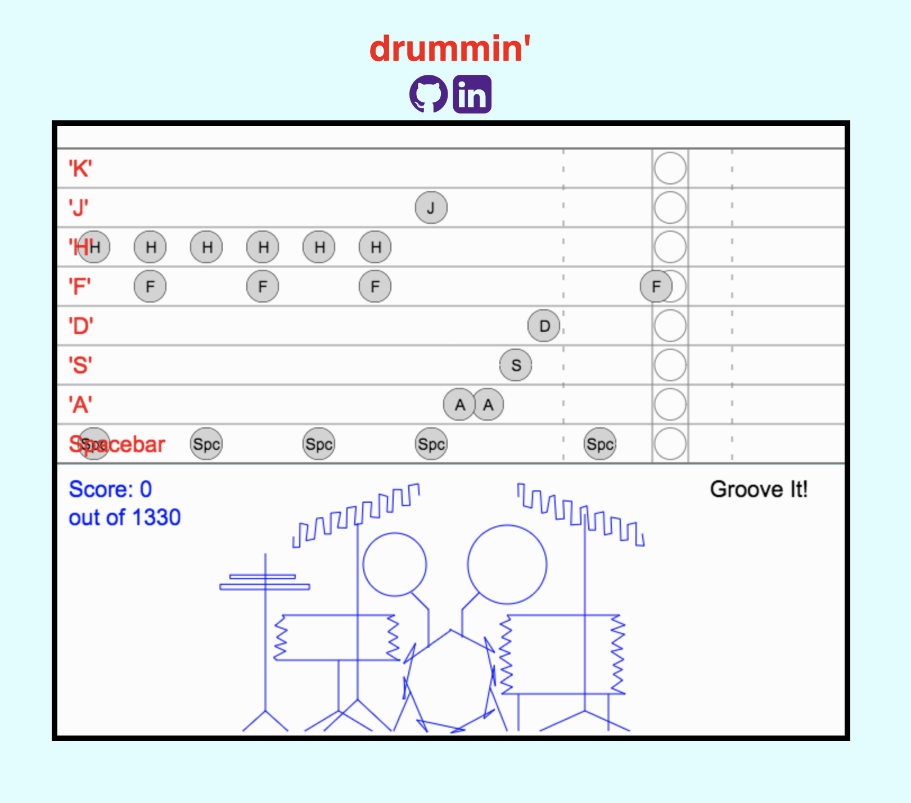

# drummin'

Javascript game that lets you play a drum set along to a track.  Scoring is based on how "in time" notes where played at.  The drum set sounds/visuals are activated using a key map created by using an event listener on "keydown".  The animation is synced to the tempo of the music using a combination of requestAnimationFrame and a displacement value derived from the distance of pixels traveled in a set amount of frames.

[Play It Here](https://mm31415.github.io/drummin/)

